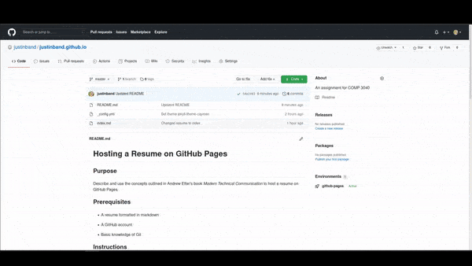

# Hosting a Resume on GitHub Pages


## Purpose

You will acquire the skills to host a resume online using GitHub Pages and Markdown. Furthermore, you will learn about static-site generators, why Git is an amazing tool, and why markdown is so darn good.

## Summary

- [Setup](#setup)
- [Customization](#customization)
- [More Resources](#more-resources)
- [Authors and Acknowledgements](#authors-and-acknowledgments)
- [FAQ](#faq)

## Prerequisites

- A resume formatted in markdown

- A GitHub account

- Basic knowledge of GitHub

- Some command line experience

## Instructions

The following steps are based on the GitHub Pages [website](https://pages.github.com/).

If you run into issues, refer to the [FAQ](#faq).

#### 1. Creating and Cloning a GitHub Repository

1. Create a public repository on GitHub named `username.github.io`. Ensure `username` is your GitHub username. 

    * For example, this repository is called `justinband.github.io`.
    <br/>

2. Using a command line, clone the repository. 

    ```
    git clone https://github.com/username/username.github.io
    ```
    * This will copy the online repository to your local files.
    * The command line is a quicker way to execute tasks that would take a long time  with a GUI.

The reason Git is used is because it's a powerful tool used for distributed version-control. In brief, this means that files can be hosted and maintaind in an online repository like GitHub. Furthermore, Git tracks previous versions of those files and catalogs the differences. Andrew Etter says that version control is "one of the most important functions of a technical writer" and Git will do it all for you with little hassle.

#### 2. Adding a Resume to the Repository

1. Create an `index.md` file.
    * Create this file in your local copy of the repository.
    
    * `index.md` will be your resume formatted in markdown. 
        * **_This name is important._** 

    * GitHub Pages first wants to render a file named `index.md`. If no such file exists, GitHub Pages will then render `README.md`. If neither files exist, GitHub Pages will not render anything.
    <br/>

2. Push `index.md` to your GitHub repository

    * In a command line, navigate to your local repository and then run the following commands.
    ```
    git add *
    git commit -m "Added index.md"
    git push -u origin master
    ```

Markdown is one of many lightweight markup languages. By far, Markdown is the most used lightweight markup language as it is simple, human-readable, and free. Moreover, Markdown and other lightweight markup languages are easy ways to get content on a webpage. Most lightweight markup languages can be easily converted to HTML, which is subsequently used by web technologies to render the content. In terms of this guide, coordination between a static-site generator and a Markdown file can easily create a webite hosting a resume. Additionally, using these tools with Git allows for Markdown files be easily managed, versioned, and tracked.

#### 3. Launching the Website

* In a browser, go to `https://username.github.io`. `username` being your GitHub username.

As Etter says, building a website like the one in this README is an easy of distributing a variety of information. Instead of sending out paper resumes (which is so 2010) a website makes a resume easily accessible to anybody, anywhere, all the time.

## Customization



GitHub Pages comes with some built-in Jekyll templates to change the style and layout of your site. To do this:

1. Go to the repository settings

2. Scrolling down, find the **GitHub Pages** section and click **Change theme**

3. Choose a theme from the list and then press **Select theme**

It may take a few minutes for your site to change themes.

Customizing your GitHub Pages site can be simple or become incredibly complex. The reason being is that GitHub Pages uses Jekyll, a tool used to create static websites. How your site looks can be changed by using Jekyll, but alas, that won't be covered here. If you want to know more, check out the Jekyll tutorial in [More Resources](#more-resources).

## More Resources

- [Andrew Etter's _Modern Technical Writing: An Introduction to Software Documentation_](https://www.amazon.ca/Modern-Technical-Writing-Introduction-Documentation-ebook/dp/B01A2QL9SS)
- [Markdown tutorial](https://www.markdowntutorial.com/)

- [Jekyll tutorial](https://jekyllrb.com/tutorials/video-walkthroughs/)
## Authors and Acknowledgments

This project uses the [Cayman Jekyll theme](https://github.com/pages-themes/cayman).

Discussions in the README are bolstered by the book, _Modern Technical Writing_ by Andrew Etter.

## FAQ

_Why is Markdown better than a word processor?_
- Markdown is better than word processors at making fast and legible documents. Markdown files are flexible that can be easily converted to other widely used filetypes including: XML, HTML, and JSON. Moreover, these filetypes can be easily rendered by websites without the required overhead when using DOCX or PDF filetypes.

_Why is my resume not showing up?_
- It can be a few things:
    - Ensure that the filename of your resume is `index.md` or `README.md`. GitHub Pages prioritizes displaying `index.md` (`index.html` works too) so if you want a README your resume should be `index.md`.
    - Ensure that the source for your GitHub Pages site is being built from the correct branch. This option can be found in the **GitHub Pages** section of your repository settings. Change the name of your resume to `index.md`. If preferred, `index.html` will also work.

_Why am I using Git for this?_

- Yes, this is only a static page. Instead, a file could be updated on the webiste and that's that. However, as outlined in Etter's book, using Git to manage files has many benefits. It allows for offline work and enables teams to concurrently work on the same project. In terms of documentation, Etter says that technical writers should use Git because developers generally like it more than other methods.

_What are the benefits of static websites over traditional websites?_

- Traditional websites built using Angular, React, or any other web language, all require expertise. Also, there may be databases, a server, or dependencies required. In contrast, static websites are fast and simple to get started as they require minimal overhead and have low coupling to other web technologies. Moreover, static websites provide a base level of setup, just enough for a website to look good. In comparison to Angular, the developer would need to create _everything_. Complexity in static sites only arise when the theme is manually edited.

_Can I use a wiki instead?_

- Definitely! Compared to static websites, wikis are a breeze. There is negligible overhead, they don't require a repository, and are easy to edit. The startup process for wikis is incredible. But, like most things in software, there are drawbacks. The most glaring one being that internet access is always required when editing a wiki. With static websites and Git everything, will always be editable on your local machine.